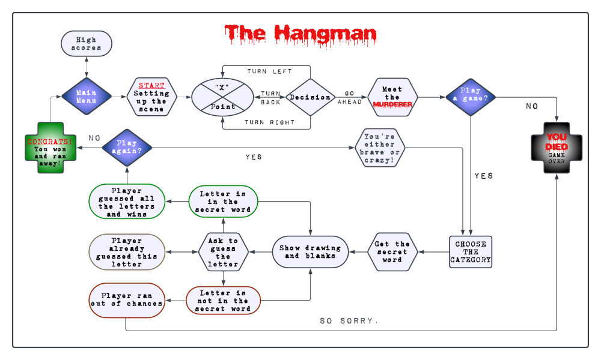

# Welcome to The Hangman game by *TulaUnogi*!

## Introduction

The Hangman is a simple Python3 console game, that runs on a mock terminal deployed on Heroku.
The goal of the game is to guess the secret words one letter at the time before running out of chances.
The number of correct and incorrect answers does not only decide on success or failure of the User,
but also it determines their score level. 
The table of High Scores is available to the User in the Main Menu.

What makes this version of The Hangman stand out is that the game itself is wrapped around a little story 
with a slightly murderous twist.
Because of that I would recommend this game for Users over the age of 15.

## The User Experience

### User Goals:

As a User I would like:

    - To have fun and be challenged.
    - To have the rules of the game explained to me in a clear manner.
    - To be informed, that in this game- just like in real life- I may die only once.
    - To be offered another round of the murderous game after winning if I would feel brave enough to try 
    earning the high scores.
    - To be able to see the table of the high scores.
    - To easily navigate through available game options and see a feedback on my inputs.

### Designer's Goals:

As a Designer I would like:

    - Users to meet their goals stated above.
    - Provide a functional and engaging game without errors.

## Design and Flow

### Flow Chart

[Lucid Chart](https://www.lucidchart.com/) was used to plan the flow of the program.

### ASCII Art

    - All the variables from the pictures module, that include letters have been made
    using https://fsymbols.com/generators/carty/.
    - The HANGMAN tree has been edited by me to contain the picture of a hangman and 
    has been sourced from https://emojicombos.com/tree-ascii-art.
    - The Murderer's face and the forest trees art were found on https://emojicombos.com/forest-ascii-art.

### Favicon and Mock Terminal

    - The favicon used for the project: "Rope" By B Illustrations from https://www.flaticon.com/free-icons/.
    - The mock terminal provided by Code Institute can be found [here](https://github.com/Code-Institute-Org/p3-template).

### Special Effects and Colours

    - [Colorama](https://pypi.org/project/colorama/) was used for defining font colours and effects. 
    Font colours have been used for both aesthetics and readability.
    - The solution for the typing effect code has been found [here](https://stackoverflow.com/questions/20302331/typing-effect-in-python) and modified for the needs of the project.

## Accessing External Data

### Google Sheet

Google Sheet was used for storing the calculated score data and it can be find [here](https://docs.google.com/spreadsheets/d/1dIswjfnn0KsCHdXZsYwd5xdTFwGasn6Ln7dQAQRxcyQ/edit?usp=sharing).

### Accessing the Secret Words and Hints

    - The secret words have been randomly generated by this [external API](https://random-word-api.herokuapp.com/word?length=5).
    - The hints for the secret words have been assigned by passing a secret word's value to PyDictionary. 
    Because this library does not include all of the secret's word's definition, I needed to handle this issue by passing the 
    hint variable the string written by me.

