# Welcome to The Hangman game by *TulaUnogi*!

## Introduction

The Hangman is a simple Python3 console game, that runs on a mock terminal deployed on Heroku.
The goal of the game is to guess the secret words one letter at the time before running out of chances.
The number of correct and incorrect answers does not only decide on success or failure of the User,
but also it determines their score level. 
The table of High Scores is available to the User in the Main Menu.

What makes this version of The Hangman stand out is that the game itself is wrapped around a little story 
with a slightly murderous twist.
Because of that I would recommend this game for Users over the age of 15.

## The User Experience

### User Goals:

As a User I would like:

    - To have fun and be challenged.
    - To have the rules of the game explained to me in a clear manner.
    - To be informed, that in this game- just like in real life- I may die only once.
    - To be offered another round of the murderous game after winning if I would feel brave enough to try 
    earning the high scores.
    - To be able to see the table of the high scores.
    - To easily navigate through available game options and see a feedback on my inputs.

### Designer's Goals:

As a Designer I would like:

    - Users to meet their goals stated above.
    - Provide a functional and engaging game without errors.

## Design and Flow

### Flow Chart

[Lucid Chart](https://www.lucidchart.com/) was used to plan the flow of the program.

### ASCII Art

    - All the variables from the pictures module, that include letters have been made
    using https://fsymbols.com/generators/carty/.
    - The HANGMAN tree has been edited by me to contain the picture of a hangman and 
    has been sourced from https://emojicombos.com/tree-ascii-art.
    - The Murderer's face and the forest trees art were found on https://emojicombos.com/forest-ascii-art.

### Favicon and Mock Terminal

    - The favicon used for the project: "Rope" By B Illustrations from https://www.flaticon.com/free-icons/.
    - The mock terminal provided by Code Institute can be found [here](https://github.com/Code-Institute-Org/p3-template).

### Special Effects and Colours

    - [Colorama](https://pypi.org/project/colorama/) was used for defining font colours and effects. 
    Font colours have been used for both aesthetics and readability.
    - The solution for the typing effect code has been found [here](https://stackoverflow.com/questions/20302331/typing-effect-in-python) and modified for the needs of the project.

## Accessing External Data

### Google Sheet

Google Sheet was used for storing the calculated score data and it can be find [here](https://docs.google.com/spreadsheets/d/1dIswjfnn0KsCHdXZsYwd5xdTFwGasn6Ln7dQAQRxcyQ/edit?usp=sharing).

### Accessing the Secret Words and Hints

    - The secret words have been randomly generated by this [external API](https://random-word-api.herokuapp.com/word?length=5).
    - The hints for the secret words have been assigned by passing a secret word's value to PyDictionary. 
    Because this library does not include all of the secret's word's definition, I needed to handle this issue by passing the 
    hint variable the string written by me.

## Game Features and Gameplay

### Main Menu

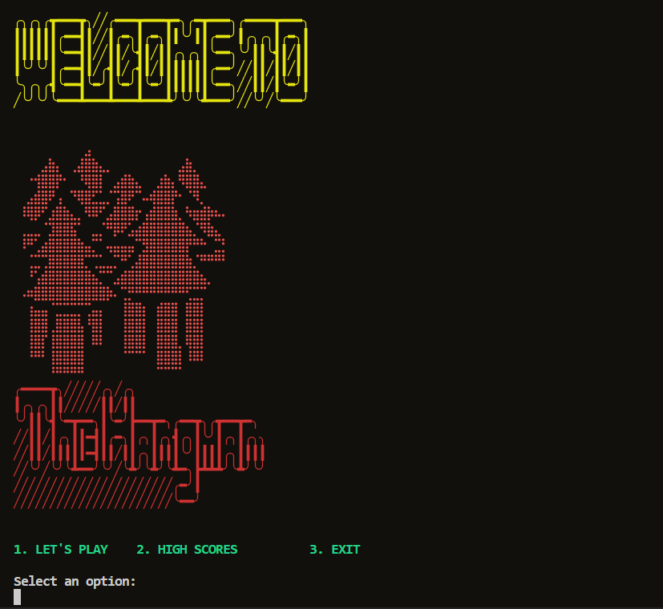

    - Main Menu is the first screen presented to the User. It welcomes the User andpresents the game logo.
    - There are 3 options displayed below the logo: "Let's Play", "High Scores" and "Exit".
    - The function takes the User's imput to determine the next step.

#### Exit

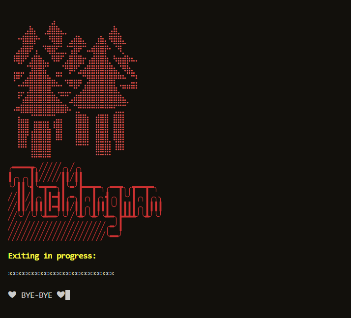

    - Choosing this option allows the User to terminate running of the program.
    - After choosing this option program takes User's input to ensure their will to quit.
    - If User confirms exiting, an exiting sequence is printed to the screen.

#### High Scores

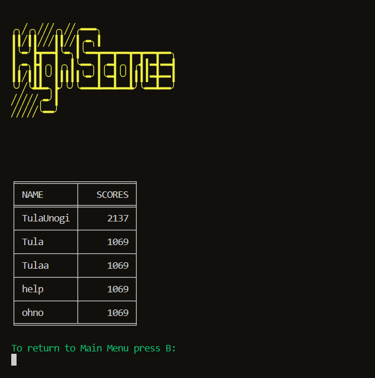

    - Displays the table of high scores and assigned to them usernames.
    - The last 5 highest results are being updated and printed here.
    - The scores are calculated with every game and may be cumulated if user decides to play more rounds.

#### Let's play

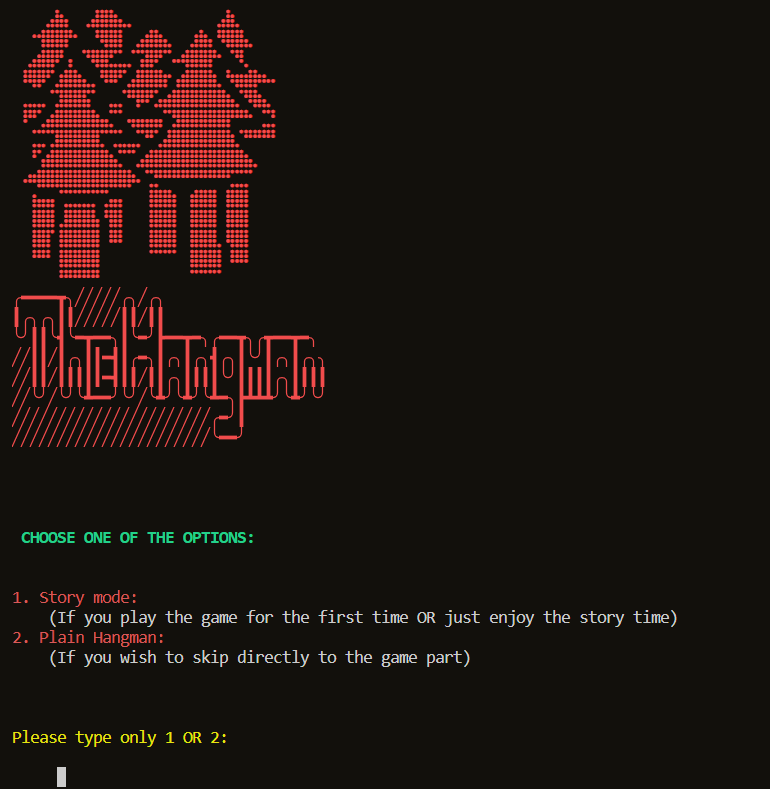

    - **Let's play** takes the User to the new screen that presents the logo and allows them to choose the game modes.
    - There are two options: **Story mode** and **Plain Hangman**
    - User's input is being taken to decide on the choosen option.

### Story Mode

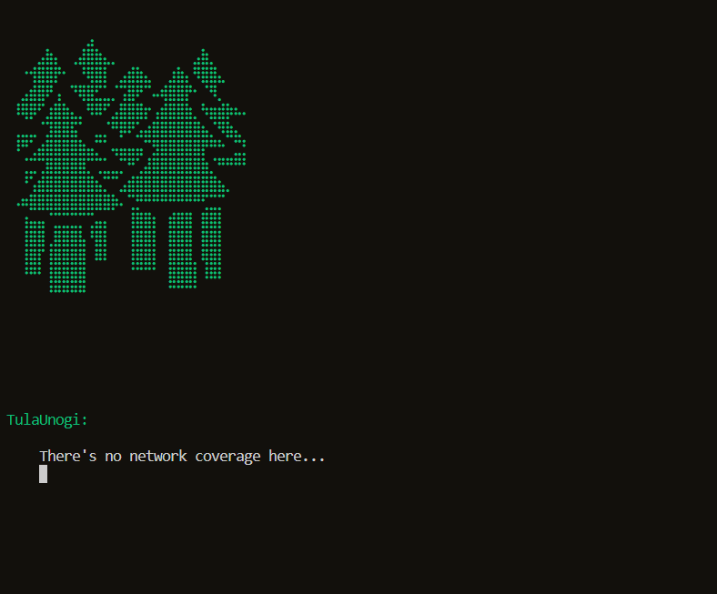

The storyline starts with the User waking up in the dark forest. User talks to themself, being lost and confused.
He talks us through their thoughts and experiences connected to their current situation.

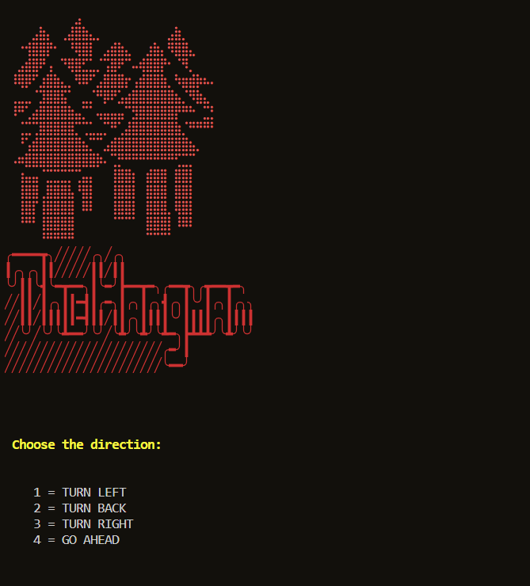

User may decide on which direction to choose and they may decide whether or not they wish to play the hangman game
with someone they've met on their way.

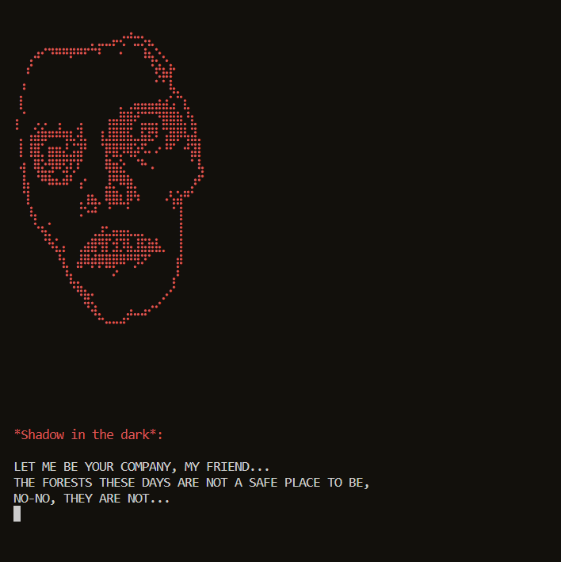

The spooky man is definitely not the nicest person in the world, but he present's the game option for the User.
That would be kind of nice of him if it wasn't a game for User's life.
If the User chooses not to play, he dies instantly.

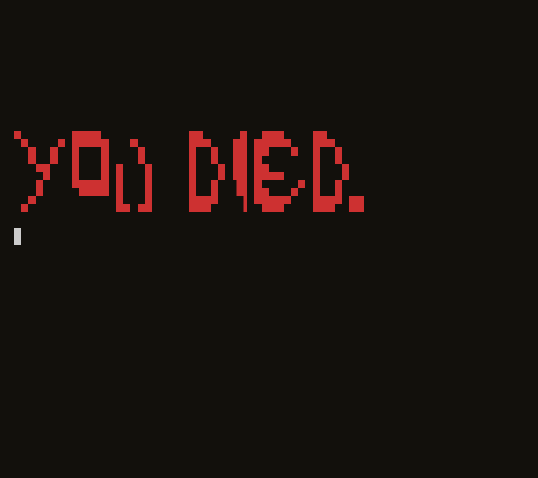

If they choose to play, they have the rules explained to them.
Next, they are presented the main Hangman game screen.

### The Hangman

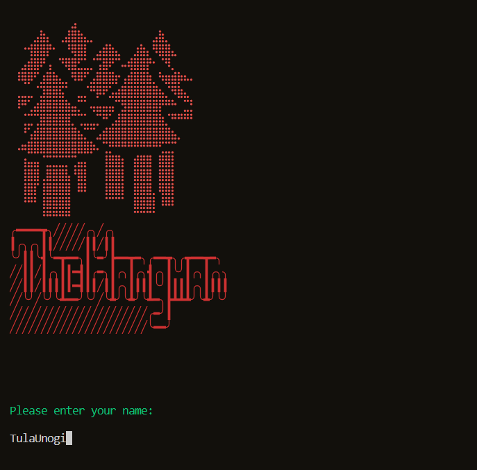

In both options- the **Story Mode** and **Plain Hangman** the username is requested from the User prior to 
starting the main game part, which allows to update a global variable being appended to the monologues and dialogues,
as well as to update the score sheet after the main game.

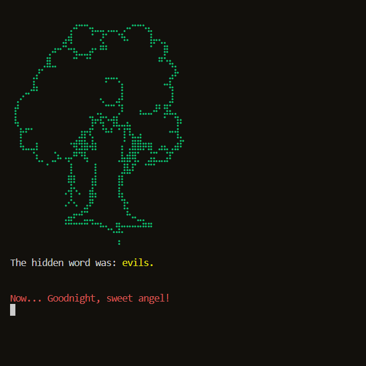

The game sets the secret random word for the user to guess. Most of the times the User gets a hint to help the game make 
a bit easier, but sometimes the User may have bad luck and be exposed to the tricky word, when the message from the Murderer
will be presented in place of the hint instead.

The game takes the User input to update the hidden word and lists of guessed and invalid letters.
The game warns the User if they already typed the same letter.

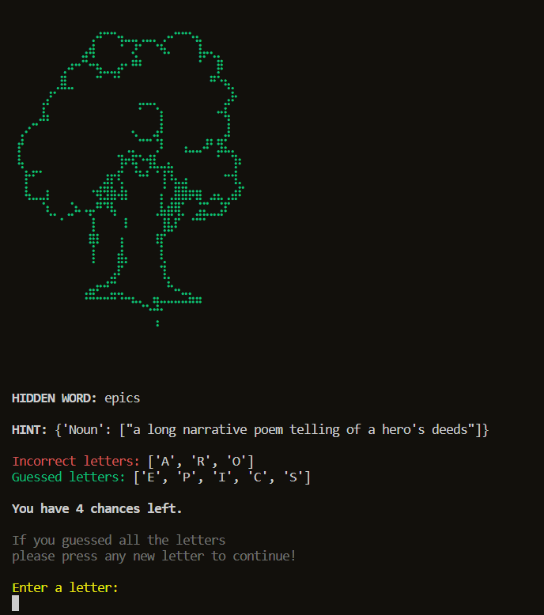

With the growing number of missed chances the User sees the progress of the Hangman picture.
When the picture is complete the User is informed that the game is over and is presented his results.

[End- game results](documentation/congrats_pic.png)

When the User wins the game he also has presented the results, but before that the congratulations are displayed to them
and the game asks them if they want to play again. They can play up to 3 rounds before they are released by the Murderer 
for good.

## Debugging and known areas for improvement

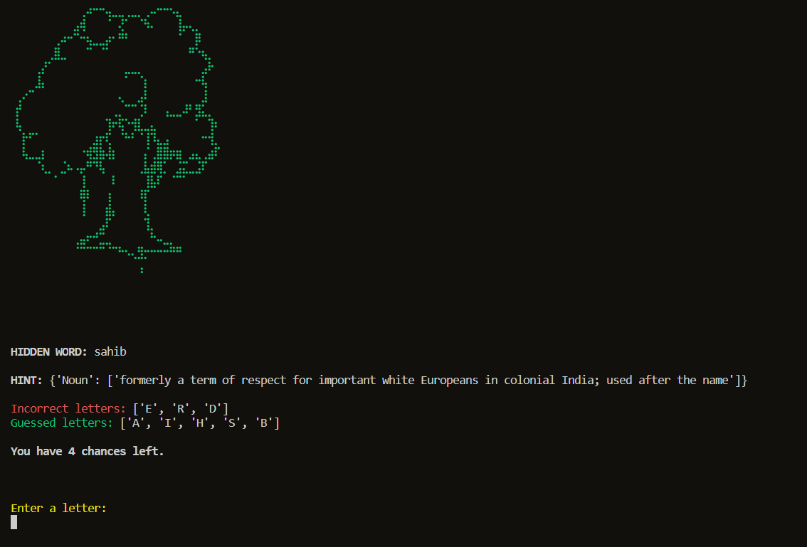

    - Debugging has been implemented through running the game multiple times and checking functionality of all
    the functions while playing.
    - There's few areas for improvement and future developement that could be addressed.
    - At this moment there's no game breaking bug known.
    - After guessing all the letters in a hidden word the game doesn't automatically move to the congratulations screen.
    The user needs to press additional new letter to trigger that function and to tackle this situation the message for
    the user has been printed on the screen.
    - Currently, if the user guesses the whole word incorrectly the game doesn't recognise it as an invalid guess. This is
    the area for the future development.
    - Adding a categories would be a good addition. While that was initially the plan, I reverted from it to try the approach
    with the external API. For this moment I'm still searching for the API that would handle multiple categories.

    

