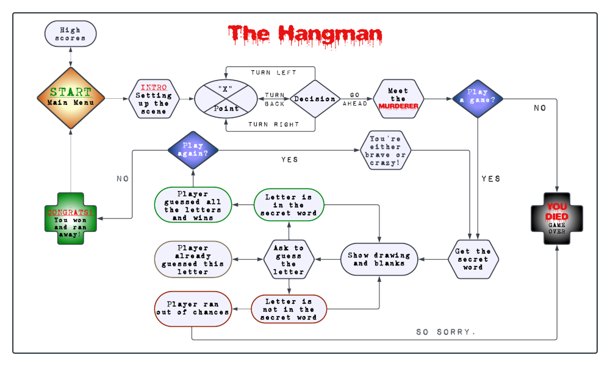

# Welcome to The Hangman game by *TulaUnogi*!

## Introduction

The Hangman is a simple Python3 console game, that runs on a mock terminal deployed on Heroku.
The goal of the game is to guess the secret words one letter at the time before running out of chances.
The number of correct and incorrect answers does not only decide on success or failure of the User,
but also it determines their score level. 
The table of High Scores is available to the User in the Main Menu.

What makes this version of The Hangman stand out is that the game itself is wrapped around a little story 
with a slightly murderous twist.
Because of that I would recommend this game for Users over the age of 15.

## The User Experience

### User Goals:

As a User I would like:

    - To have fun and be challenged.
    - To have the rules of the game explained to me in a clear manner.
    - To be informed, that in this game- just like in real life- I may die only once.
    - To be offered another round of the murderous game after winning if I would feel brave enough to try 
    earning the high scores.
    - To be able to see the table of the high scores.
    - To easily navigate through available game options and see a feedback on my inputs.

### Designer's Goals:

As a Designer I would like:

    - Users to meet their goals stated above.
    - Provide a functional and engaging game without errors.

## Design and Flow

### Flow Chart

[Lucid Chart](https://www.lucidchart.com/) was used to plan the flow of the program.

### ASCII Art

    - All the variables from the pictures module, that include letters have been made
    using https://fsymbols.com/generators/carty/.
    - The HANGMAN tree has been edited by me to contain the picture of a hangman and 
    has been sourced from https://emojicombos.com/tree-ascii-art.
    - The Murderer's face and the forest trees art were found on https://emojicombos.com/forest-ascii-art.

### Favicon and Mock Terminal

    - The favicon used for the project: "Rope" By B Illustrations from https://www.flaticon.com/free-icons/.
    - The mock terminal provided by Code Institute can be found [here](https://github.com/Code-Institute-Org/p3-template).

### Special Effects and Colours

    - [Colorama](https://pypi.org/project/colorama/) was used for defining font colours and effects. 
    Font colours have been used for both aesthetics and readability.
    - The solution for the typing effect code has been found [here](https://stackoverflow.com/questions/20302331/typing-effect-in-python) and modified for the needs of the project.

## Accessing External Data

### Google Sheet

Google Sheet was used for storing the calculated score data and it can be find [here](https://docs.google.com/spreadsheets/d/1dIswjfnn0KsCHdXZsYwd5xdTFwGasn6Ln7dQAQRxcyQ/edit?usp=sharing).

### Accessing the Secret Words and Hints

    - The secret words have been randomly generated by this [external API](https://random-word-api.herokuapp.com/word?length=5).
    - The hints for the secret words have been assigned by passing a secret word's value to PyDictionary. 
    Because this library does not include all of the secret's word's definition, I needed to handle this issue by passing the 
    hint variable the string written by me.

## Game Features and Gameplay

### Main Menu

    - Main Menu is the first screen presented to the User. It welcomes the User andpresents the game logo.
    - There are 3 options displayed below the logo: "Let's Play", "High Scores" and "Exit".
    - The function takes the User's imput to determine the next step.

#### Exit

    - Choosing this option allows the User to terminate running of the program.
    - After choosing this option program takes User's input to ensure their will to quit.
    - If User confirms exiting, an exiting sequence is printed to the screen.

#### High Scores

    - Displays the table of high scores and assigned to them usernames.
    - The last 5 highest results are being updated and printed here.
    - The scores are calculated with every game and may be cumulated if user decides to play more rounds.

#### Let's play

    - **Let's play** takes the User to the new screen that presents the logo and allows them to choose the game modes.
    - There are two options: **Story mode** and **Plain Hangman**
    - User's input is being taken to decide on the choosen option.

### Story Mode

The storyline starts with the User waking up in the dark forest. User talks to themself, being lost and confused.
He talks us through their thoughts and experiences connected to their current situation.

User may decide on which direction to choose and they may decide whether or not they wish to play the hangman game
with someone they've met on their way.

The spooky man is definitely not the nicest person in the world, but he present's the game option for the User.
That would be kind of nice of him if it wasn't a game for User's life.
If the User chooses not to play, he dies instantly.

If they choose to play, they have the rules explained to them.
Next, they are presented the main Hangman game screen.

### The Hangman

In both options- the **Story Mode** and **Plain Hangman** the username is requested from the User prior to 
starting the main game part, which allows to update a global variable being appended to the monologues and dialogues,
as well as to update the score sheet after the main game.

The game sets the secret random word for the user to guess. Most of the times the User gets a hint to help the game make 
a bit easier, but sometimes the User may have bad luck and be exposed to the tricky word, when the message from the Murderer
will be presented in place of the hint instead.

The game takes the User input to update the hidden word and lists of guessed and invalid letters.
The game warns the User if they already typed the same letter.

With the growing number of missed chances the User sees the progress of the Hangman picture.
When the picture is complete the User is informed that the game is over and is presented his results.

[End- game results](documentation/congrats_pic.png)

When the User wins the game he also has presented the results, but before that the congratulations are displayed to them
and the game asks them if they want to play again. They can play up to 3 rounds before they are released by the Murderer 
for good.

## Debugging and known areas for improvement

    - Debugging has been implemented through running the game multiple times and checking functionality of all
    the functions while playing.
    - There's few areas for improvement and future developement that could be addressed.
    - At this moment there's no game breaking bug known.
    - There's an index out of range error displaying, that needs to be resolved with the next update
    - After guessing all the letters in a hidden word the game doesn't automatically move to the congratulations screen.
    The user needs to press additional new letter to trigger that function and to tackle this situation the message for
    the user has been printed on the screen.
    - Currently, if the user guesses the whole word incorrectly the game doesn't recognise it as an invalid guess. This is
    the area for the future development.
    - The size of the mockup terminal is a bit small for the game to display fully, in a future update this should be solved.
    - Adding a categories would be a good addition. While that was initially the plan, I reverted from it to try the approach
    with the external API. For this moment I'm still searching for the API that would handle multiple categories.

## Technologies Used

### Programming languages

    - [HTML5](documentation/directions_pic.png)
    - [CSS3](https://en.wikipedia.org/wiki/CSS)
    - [Python](https://en.wikipedia.org/wiki/Python_(programming_language))

### Other

    - [Github](https://github.com/) - storing the code and version control
    - [Codeanywhere](https://app.codeanywhere.com/) - initially used to write and commit the code
    - [Gitpod](https://www.gitpod.io/) - used after Codeanywhere had issues with running the workspace
    - [Lucid Chart](https://www.lucidchart.com/pages/)- used to create the flow chart
    - [Google Sheets](https://www.google.co.uk/sheets/about/)- for storing and accessing the scores data
    - [Heroku](https://dashboard.heroku.com/apps) - for deploying the project

### Python Libraries Used

    - Colorama
    - sys
    - os
    - time
    - requests
    - gspread
    - google.oauth
    - math
    - PyDictionary
    - tabulate

## Deployment

The app has been deployed on Heroku.
**The deployment build log:**

-----> Building on the Heroku-22 stack
-----> Using buildpacks:
       1. heroku/python
       2. heroku/nodejs
-----> Python app detected
-----> No Python version was specified. Using the buildpack default: python-3.11.4
       To use a different version, see: https://devcenter.heroku.com/articles/python-runtimes
-----> Installing python-3.11.4
-----> Installing pip 23.1.2, setuptools 67.8.0 and wheel 0.40.0
-----> Installing SQLite3
-----> Installing requirements with pip
       Collecting cachetools==5.3.1 (from -r requirements.txt (line 1))
         Downloading cachetools-5.3.1-py3-none-any.whl (9.3 kB)
       Collecting click==8.1.5 (from -r requirements.txt (line 2))
         Downloading click-8.1.5-py3-none-any.whl (98 kB)
       Collecting colorama==0.4.6 (from -r requirements.txt (line 3))
         Downloading colorama-0.4.6-py2.py3-none-any.whl (25 kB)
       Collecting futures==3.0.5 (from -r requirements.txt (line 4))
         Downloading futures-3.0.5.tar.gz (25 kB)
         Preparing metadata (setup.py): started
         Preparing metadata (setup.py): finished with status 'done'
       Collecting google-auth==2.22.0 (from -r requirements.txt (line 5))
         Downloading google_auth-2.22.0-py2.py3-none-any.whl (181 kB)
       Collecting google-auth-oauthlib==1.0.0 (from -r requirements.txt (line 6))
         Downloading google_auth_oauthlib-1.0.0-py2.py3-none-any.whl (18 kB)
       Collecting goslate==1.5.4 (from -r requirements.txt (line 7))
         Downloading goslate-1.5.4.tar.gz (14 kB)
         Preparing metadata (setup.py): started
         Preparing metadata (setup.py): finished with status 'done'
       Collecting gspread==5.10.0 (from -r requirements.txt (line 8))
         Downloading gspread-5.10.0-py3-none-any.whl (44 kB)
       Collecting oauthlib==3.2.2 (from -r requirements.txt (line 9))
         Downloading oauthlib-3.2.2-py3-none-any.whl (151 kB)
       Collecting pyasn1==0.5.0 (from -r requirements.txt (line 10))
         Downloading pyasn1-0.5.0-py2.py3-none-any.whl (83 kB)
       Collecting pyasn1-modules==0.3.0 (from -r requirements.txt (line 11))
         Downloading pyasn1_modules-0.3.0-py2.py3-none-any.whl (181 kB)
       Collecting PyDictionary==2.0.1 (from -r requirements.txt (line 12))
         Downloading PyDictionary-2.0.1-py3-none-any.whl (6.1 kB)
       Collecting requests-oauthlib==1.3.1 (from -r requirements.txt (line 13))
         Downloading requests_oauthlib-1.3.1-py2.py3-none-any.whl (23 kB)
       Collecting rsa==4.9 (from -r requirements.txt (line 14))
         Downloading rsa-4.9-py3-none-any.whl (34 kB)
       Collecting tabulate==0.9.0 (from -r requirements.txt (line 15))
         Downloading tabulate-0.9.0-py3-none-any.whl (35 kB)
       Collecting six>=1.9.0 (from google-auth==2.22.0->-r requirements.txt (line 5))
         Downloading six-1.16.0-py2.py3-none-any.whl (11 kB)
       Collecting urllib3<2.0 (from google-auth==2.22.0->-r requirements.txt (line 5))
         Downloading urllib3-1.26.16-py2.py3-none-any.whl (143 kB)
       Collecting bs4 (from PyDictionary==2.0.1->-r requirements.txt (line 12))
         Downloading bs4-0.0.1.tar.gz (1.1 kB)
         Preparing metadata (setup.py): started
         Preparing metadata (setup.py): finished with status 'done'
       Collecting requests (from PyDictionary==2.0.1->-r requirements.txt (line 12))
         Downloading requests-2.31.0-py3-none-any.whl (62 kB)
       Collecting charset-normalizer<4,>=2 (from requests->PyDictionary==2.0.1->-r requirements.txt (line 12))
         Downloading charset_normalizer-3.2.0-cp311-cp311-manylinux_2_17_x86_64.manylinux2014_x86_64.whl (199 kB)
       Collecting idna<4,>=2.5 (from requests->PyDictionary==2.0.1->-r requirements.txt (line 12))
         Downloading idna-3.4-py3-none-any.whl (61 kB)
       Collecting certifi>=2017.4.17 (from requests->PyDictionary==2.0.1->-r requirements.txt (line 12))
         Downloading certifi-2023.5.7-py3-none-any.whl (156 kB)
       Collecting beautifulsoup4 (from bs4->PyDictionary==2.0.1->-r requirements.txt (line 12))
         Downloading beautifulsoup4-4.12.2-py3-none-any.whl (142 kB)
       Collecting soupsieve>1.2 (from beautifulsoup4->bs4->PyDictionary==2.0.1->-r requirements.txt (line 12))
         Downloading soupsieve-2.4.1-py3-none-any.whl (36 kB)
       Building wheels for collected packages: futures, goslate, bs4
         Building wheel for futures (setup.py): started
         Building wheel for futures (setup.py): finished with status 'done'
         Created wheel for futures: filename=futures-3.0.5-py3-none-any.whl size=14069 sha256=ad0ca45c5efe907bed9e4714eca3b026798a2a40a3f94b15fe3e137e21f359c1
         Stored in directory: /tmp/pip-ephem-wheel-cache-nbxqbu2j/wheels/66/cb/37/51fe32ecb9068869196ce81111bdfe82e6ecb53c889362f81b
         Building wheel for goslate (setup.py): started
         Building wheel for goslate (setup.py): finished with status 'done'
         Created wheel for goslate: filename=goslate-1.5.4-py3-none-any.whl size=11579 sha256=aafaa95bad34547f0ea7041a45c7a7431e3a149332606d7fdfb091bd5e6fae97
         Stored in directory: /tmp/pip-ephem-wheel-cache-nbxqbu2j/wheels/b6/48/7a/e7458e7a110a5525687dd17a52d3e42c157a8d22a2c4d5e840
         Building wheel for bs4 (setup.py): started
         Building wheel for bs4 (setup.py): finished with status 'done'
         Created wheel for bs4: filename=bs4-0.0.1-py3-none-any.whl size=1257 sha256=a9e1e1fe9695cd240e16a599478326951b15dbea2a88af5d96e582b7657dd5c5
         Stored in directory: /tmp/pip-ephem-wheel-cache-nbxqbu2j/wheels/d4/c8/5b/b5be9c20e5e4503d04a6eac8a3cd5c2393505c29f02bea0960
       Successfully built futures goslate bs4
       Installing collected packages: futures, urllib3, tabulate, soupsieve, six, pyasn1, oauthlib, idna, goslate, colorama, click, charset-normalizer, certifi, cachetools, rsa, requests, pyasn1-modules, beautifulsoup4, requests-oauthlib, google-auth, bs4, PyDictionary, google-auth-oauthlib, gspread
       Successfully installed PyDictionary-2.0.1 beautifulsoup4-4.12.2 bs4-0.0.1 cachetools-5.3.1 certifi-2023.5.7 charset-normalizer-3.2.0 click-8.1.5 colorama-0.4.6 futures-3.0.5 google-auth-2.22.0 google-auth-oauthlib-1.0.0 goslate-1.5.4 gspread-5.10.0 idna-3.4 oauthlib-3.2.2 pyasn1-0.5.0 pyasn1-modules-0.3.0 requests-2.31.0 requests-oauthlib-1.3.1 rsa-4.9 six-1.16.0 soupsieve-2.4.1 tabulate-0.9.0 urllib3-1.26.16
-----> Node.js app detected
       
-----> Creating runtime environment
       
       NPM_CONFIG_LOGLEVEL=error
       NODE_VERBOSE=false
       NODE_ENV=production
       NODE_MODULES_CACHE=true
       
-----> Installing binaries
       engines.node (package.json):  unspecified
       engines.npm (package.json):   unspecified (use default)
       
       Resolving node version 18.x...
       Downloading and installing node 18.16.1...
       Using default npm version: 9.5.1
       
-----> Installing dependencies
       Installing node modules (package.json)
       
       added 9 packages, and audited 10 packages in 4s
       
       4 vulnerabilities (1 moderate, 1 high, 2 critical)
       
       To address issues that do not require attention, run:
         npm audit fix
       
       To address all issues possible (including breaking changes), run:
         npm audit fix --force
       
       Some issues need review, and may require choosing
       a different dependency.
       
       Run `npm audit` for details.
       npm notice 
       npm notice New minor version of npm available! 9.5.1 -> 9.8.0
       npm notice Changelog: <https://github.com/npm/cli/releases/tag/v9.8.0>
       npm notice Run `npm install -g npm@9.8.0` to update!
       npm notice 
       
-----> Build
       
-----> Caching build
       - node_modules
       
-----> Pruning devDependencies
       
       up to date, audited 10 packages in 249ms
       
       4 vulnerabilities (1 moderate, 1 high, 2 critical)
       
       To address issues that do not require attention, run:
         npm audit fix
       
       To address all issues possible (including breaking changes), run:
         npm audit fix --force
       
       Some issues need review, and may require choosing
       a different dependency.
       
       Run `npm audit` for details.
       
-----> Build succeeded!
-----> Discovering process types
       Procfile declares types -> web
-----> Compressing...
       Done: 70.5M
-----> Launching...
       Released v5
       https://the-hangman-by-tulaunogi-04f645de319a.herokuapp.com/ deployed to Heroku

       

Special thanks for my Mentor Narender Singh for his help, support and patience!

